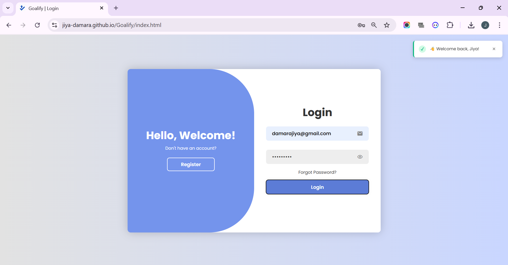
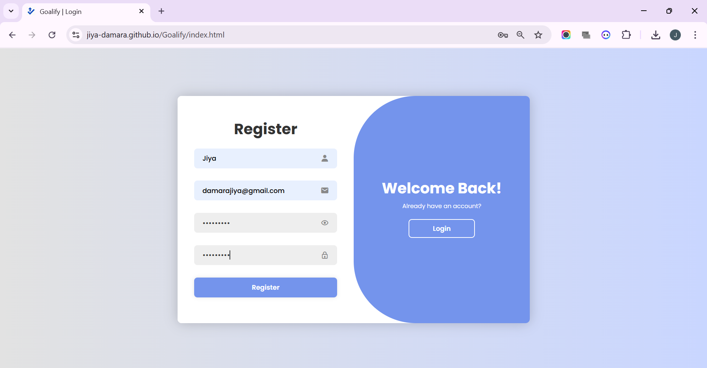
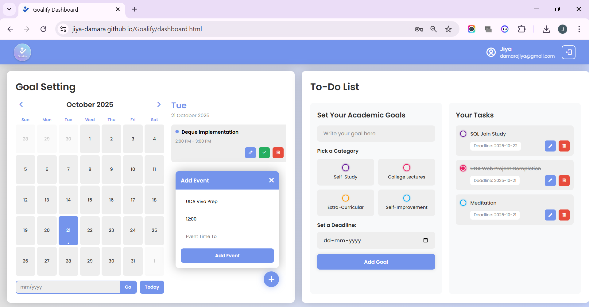

# 🎯 Goalify - Goal & Task Management Dashboard

<div align="center">

**A simple calendar-based app to set goals, check off progress, and manage daily tasks.**


*UCA Evaluation 1 Project*

</div>

---

## 📋 Overview

Goalify is a productivity app that helps you stay organized with calendar-based event tracking and a categorized todo list system. Built with vanilla HTML, CSS, and JavaScript, it provides a clean interface for managing your daily tasks and goals.

---

## 🎯 Objectives

- Stay on top of daily tasks with easy marking and tracking
- Set deadlines to maintain accountability
- Use calendar-based event marking for better day planning
- Categorize tasks for better organization
- Track progress with visual completion indicators

---

## ✨ Features

| Feature | Description |
|---------|-------------|
| **User Authentication** | Secure login/register with validation and password recovery |
| **Interactive Calendar** | Monthly view with date navigation and event indicators |
| **Event Management** | Add, edit, mark done, and delete events with time slots |
| **Todo List** | Create tasks with categories and deadlines |
| **Task Categories** | Self-Study, College Lectures, Extra-Curricular, Self-Improvement |
| **Task Actions** | Edit, complete, and delete tasks inline |
| **Responsive Design** | Works on desktop, tablet, and mobile devices |
| **Local Storage** | All data saved automatically in your browser |
| **Toast Notifications** | Real-time feedback for user actions |

---

## 📁 Project Structure

```
Goalify/
├── assets/          # Logo, favicon
│   └── screenshots/ # Screenshots of webpages
├── css/             # Styling files
│   ├── dashboard.css
│   └── login.css
├── js/              # JavaScript logic
│   ├── auth.js
│   ├── dashboard.js
│   └── toast.js
├── index.html       # Login/Register page
└── dashboard.html   # Main dashboard
```

---

## 🧩 Components

### 1. Login/Register Page
- Animated toggle between login and register forms
- Input validation and password strength requirements
- Forgot password functionality

**[Screenshot placeholder]**

---

## 📸 Screenshots

Add screenshots to the `assets/` folder and reference them from this README. Recommended filenames:

- `assets/screenshots/login.png` — Login page screenshot
- `assets/screenshots/register.png` — Register page screenshot
- `assets/screenshots/dashboard.png` — Dashboard screenshot

Recommended image sizes for README display:
- Width: 900px (max) — scales nicely on GitHub and keeps layout clean
- Height: auto — preserves aspect ratio

Markdown example (place these inside this README where you want the images to appear):

```markdown
### Login Page


### Register Page


### Dashboard

```

If you prefer to control size in HTML (works in some markdown renderers):

```html
<p align="center">
	
</p>
```

Notes:
- Use descriptive alt text (helps accessibility). Example: `alt="Goalify dashboard showing calendar and todo list"`.
- Keep actual screenshot files inside `assets/screenshots/` to stay organized.
- If images don't load on GitHub, ensure the files are committed and pushed to the repository and that the paths match exactly (case-sensitive on some platforms).


### 2. Dashboard

**Left Side - Calendar:**
- Monthly calendar with navigation
- Add events with time slots
- View and manage events for selected dates

**Right Side - Todo List:**
- Create tasks with categories
- Set deadlines
- Mark complete and edit tasks

**[Screenshot placeholder]**

---

## 🚀 How to Run

1. **Download** or clone the project
2. **Open** `index.html` in your browser
3. **Register** a new account
4. **Start** adding tasks and events!

> Note: All data is stored locally in your browser

---

## 💻 Tech Stack

- **HTML5** - Structure
- **CSS3** - Styling & animations
- **JavaScript** - Logic & interactivity
- **Local Storage** - Data persistence

No frameworks or libraries - pure vanilla JavaScript!

---

## 🔮 Future Ideas

- Dark mode toggle
- Data export (CSV/JSON)
- Cloud sync
- Reminders and notifications
- Statistics dashboard

---

## 📧 Contact

**Email:** your.email@example.com  
**GitHub:** [@yourusername](https://github.com/yourusername)

---

<div align="center">

**Made for UCA Evaluation 1** ❤️

⭐ Star if you like it!

</div>